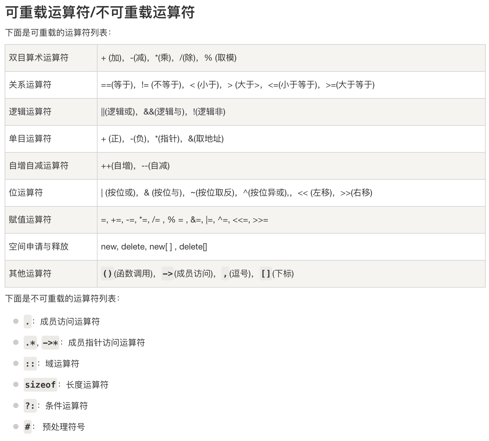

// learn from runoob.com
1、基本语法
    标识符命名：数字、字母、下划线，其中数字不能开头
    terminal进行编译：g++ hello.cpp -o hello // -o 指定可执行程序的文件名
                     ./hello    //执行生成的可执行文件
2、数据类型
    内置数据类型：bool、char、int、float、double、void、wchar_t
    类型修饰符：signed、unsigned、short、long
    用户自定义：typedef int C

3、变量类型
    声明：extern int a,b; void foo();
    定义：int a; void foo() { ... }

4、变量作用域
    局部变量、全局变量

5、常量
    常量可以是任何的基本数据类型；
    整数常量可以是十进制、八进制、十六进制，前缀为0x或0X为十六进制,0为八进制
    整数常量可以带一个后缀，U为无符号unsigned，L表示长整数long
    还有浮点常量、布尔常量、字符常量、字符串常量
    定义常量：#define LENGTH 10
             const int LENGTH = 10;

6、修饰符类型
    signed、unsigned、long、short、const、volatile、restrict

7、存储类（这个貌似之前没有关注过～）
    存储类定义C++程序中变量/函数的范围（可见性）和生命周期，这些说明符放置在它们修饰的类型之前。
    auto：
    register：
    static：
    extern：
    mutable：
    thread_local(C++)：

8、运算符
    算术、关系、逻辑、位运算、赋值、杂项
    运算符的优先级

9、循环
    循环类型：while、for、do...while、嵌套循环
    循环控制语句：break、continue、goto

10、判断
    判断语句：if、if...else、嵌套if、switch、嵌套switch
    ？：运算符：a > 1 ? return 1:return 2;

11、函数
    函数声明：告诉编译器函数的名称、返回类型、参数
    函数定义：提供函数的实际主体
    函数调用
    函数参数：传值调用、
             指针调用（void swap(int *x, int *y){ tmp = *x }  swap(&a, &b);）
             引用调用 (void swap(int &a, int &b){ tmp = a }  swap(a,b);)
    参数的默认值 (void swap(int a=10, int b=20))
    Lambda函数与表达式 ？？？？(还不是特别了解)

12、数字
    short、int、float、double、long
    数学运算：c++中包含各种有用的内置函数，如<cmath>
    随机数生成：rand()，该函数返回一个伪随机数，生成随机数之前必须先调用srand()，
                可以使用<ctime>中的time()获取当前时间来设置srand()的种子参数

13、数组
    数组声明，需要指定元素的类型和元素的数量
    所有数组都是由连续的内存位置组成。最低的地址对应第一个元素，最高的地址对应最后一个元素。
    声明数组、数组赋值、访问数组
    多为数组：int a[3][4] = {{1,2,3,4},{5,6,7,8},{9,10,11,12}}
    指向数组的指针： double *p;double balance[10];p=balance;cout<<*p<<*(p+1)<<*(p+2)<<endl;
    传递数组给函数：void function1(int *param){...}
                  void function2(int param[10]){...}
                  void function3(int param[]){...}
    从函数返回数组：C++不允许返回一个完整的数组作为函数的参数，但是可以通过指定不带索引的数组名来返回一个
                    指向数组的指针，函数需要声明为返回指针的函数。且c++不支持在函数外访问返回的局部变量地址，因此局部变量定义为static变量
                    int *function(){ static int r[10]; ... return r;}

14、字符串
    c风格字符串：源于c语言，并在C++中继续得到支持，如char a[]="hello";或char a[6]={'h','e','l','l','o','\0'};
    在这种情况下，属于c语言风格的字符串，c++提供内置函数<cstring>，其中的常用函数有strcpy(s1,s2);strlen(s1)等；
    注意：此处的字符串，不能写成string a = "hello"，因为string不是基本的数据类型，而是c++标准库中的一个类类型。
    c++中的string类，#include<string> string a="hello";cout<<a.size()<<endl;

15、指针
    指针的值 和 指针的所指向的变量或常量 要区分
    指针是一个变量，指针的值是其所指向变量或常量在内存中的地址
    一般操作为：定义一个指针变量、把变量地址赋值给指针、访问指针变量中可用地址的值
    int var=20; int *p; p=&var;cout<<var<<p<<*p<<endl; （20，地址，20）
    c++中的Null指针：int *ptr=NULL; cout<<ptr; (输出值为 0 即地址为0)
                    用处：可以给指针初始化为NULL，在使用之前进行判断if(!ptr)，即为非空指针，已经赋值，避免访问到操作系统预留的内存空间
    c++指针的算术运算：ptr指向地址1000的整数指针，是一个32为的整数，即4个字节，若进行ptr++操作，则会指向地址1004，不是1001，
                        因为ptr每增加一次，会指向下一个整数位置，即当前位置往后移4个字节，如果ptr指向字符，则ptr++之后的地址则为1001
                     递增一个指针：变量指针可以递增，而数组不能递增，因为数组是一个常量指针：int var[3]={1,2,3};int *ptr;ptr=var;ptr++;
                     递减一个指针：ptr=&var[MAX-1];ptr--;
                     指针的比较：ptr=var;if(ptr<=&var[MAX-1]){... ptr++;}
    c++指针数组：int *ptr[MAX]; （还不是特别了解）
    c++指向指针的指针：多级间接寻址
                     int var; int *ptr; int **pptr;
                     ptr = &var; pptr = &ptr;
    c++传递指针给函数：void function(int *par){};   可以传递指针，当然也可以传递数组
    c++从函数返回指针：首先声明一个返回指针的函数；c++不支持在函数外返回局部变量的地址，所以需要将局部变量定义为static
                     int *getNumber(){ static int r[10];    return r;}

16、引用
    引用vs指针：1、不存在空引用。引用必须连接到一块合法的内存。
               2、一旦引用被初始化为一个对象，就不能被指向到另一个对象。指针可以在任何时候指向到另一个对象。
               3、引用必须在创建时被初始化。指针可以在任何时间被初始化。
    int i=17; int& r=i; //r 是一个初始化为 i 的整型引用
    把引用当作参数：void swap(int& a, int& b){...}  int a=10,b=20;swap(a,b); 引用就是别名，指向的内存地址是一样的
    把应用当作返回值：返回的引用类型值，要么属于全局变量，要么被static修饰

17、日期&时间
    c++标准库没有提供所谓的日期类型，c++继承类c语言用于日期和时间操作的结构和函数，头文件为<ctime>
    四个时间相关的类型：clock_t、time_t、size_t、tm，其中前三种都能够把系统时间和日期表示为某种整数。
    tm属于结构体类型
    活用各种日期和时间的重要函数：time()、ctime()、localtime()...
    使用结构tm格式化时间：time_t now = time(0); tm *ltm = localtime(&now); cout<<ltm->year<<endl;

18、基本的输入输出
    c++的I/O发生在流中，流是字节序列，如果字节流从设备流向内存，则是输入操作；反之为输出操作。
    I/O库头文件：<iostream>:cin,cout,cerr,clog
                <iomanip>: 该文件通过所谓的参数化的流操纵器，来声明对执行标准化I/O有用的服务
                <fstream>:该文件为用户控制的文件处理声明服务。
    <iostream>:cin、cout不多做介绍；
               cerr为标准错误流，cerr对象附属到标准错误设备，通常是显示屏，但是cerr对象是非缓冲的，且每个流插入到cerr都会立即输出
               clog为标准日志流，clog对象附属到标准错误设备，通常是显示屏，但是clog对象是缓冲的，意味着每个流插入到clog都会先存储在缓冲中，直到缓冲填满或者缓冲区刷新时才会输出
               注：在编写和执行大型程序时，它们之间的差异就变得非常明显。所以良好的编程实践告诉我们，使用cerr流来显示错误消息，而其他的日志消息则使用clog流来输出。

19、数据结构
    c/c++数组允许定义可存储相同类型数据项的变量，但是结构(结构体)是c++中另一种用户自定义的可用数据类型，允许存储不同类型的数据项
    struct Book{char title[50];char author[50];char subject[50];int bood_id};
    或者 struct Book{char title[50];char author[50];char subject[50];int bood_id} book1;
    使用成员访问运算符(.)来访问结构体的成员：Book book1; cout<<book1.title<<endl;
    结构作为函数参数：传参方式和其他类型的变量或指针类似
    指向结构的指针：struct Book *struct_ptr; struct_ptr=&book1;count<<struct_ptr->title<<endl;
    typeset关键字: typedef struct{char title[50];char author[50];char subject[50];int bood_id}Book; Book boo1,boo2;

20、C++类&对象
    关键字public、private、protected可以确定类成员的访问属性；
    公共成员可以使用直接成员访问运算符 (.) 来直接访问；
    私有的成员和受保护的成员不能使用直接成员访问运算符 (.) 来直接访问；
    类成员函数：类成员函数是类的一个成员，它可以操作类的任意对象，可以访问对象中的所有成员。
               成员函数可以定义在类定义内部，或者单独使用范围解析运算符 :: 来定义; ::可以不跟类名，表示全局数据或全局函数（即非成员函数）。
               在类定义中定义的成员函数把函数声明为内联的，即便没有使用 inline 标识符。
               在类的外部使用范围解析运算符::定义该函数：char[] Book::getTitle(void){return title;}
    类访问修饰符：public：公有成员在程序中类的外部是可访问的；
                private：私有成员变量或函数在类的外部是不可访问的，甚至是不可查看的。只有类和友元函数可以访问私有成员。
                         默认情况下，类的所有成员都是私有的
                protected：保护成员变量或函数与私有成员十分相似，都不能在类的外部访问；但有一点不同，保护成员在派生类（即子类）中是可访问的。
                          即子类的成员方法可以访问父类的保护成员变量
                继承：public继承：基类的public、protected、private成员的访问属性在派生类中变成了public、protected、private
                     private继承：基类的public、protected、private成员的访问属性在派生类中变成了private、private、private
                     protected继承：基类的public、protected、private成员的访问属性在派生类中变成了protected、protected、private
    类构造函数&析构函数：构造函数：类的构造函数是类的一种特殊的成员函数，它会在每次创建类的新对象时执行。构造函数的名称与类的名称是
                               完全相同的，并且不会返回任何类型，也不会返回 void。构造函数可用于为某些成员变量设置初始值。可以无参，也可以有参；
                               class Book{...}; Book::Book(char[] Title){title=Title;}
                               等价于使用初始化列表来初始化字段：class Book{...}; Book::Book(char[] Title):title(Title){...} 多个参数则用(,)分开
                       析构函数：类的析构函数是类的一种特殊的成员函数，它会在每次删除所创建的对象时执行。析构函数的名称与类的名称是完全相同的，只是在前面
                                加了个波浪号（~）作为前缀，它不会返回任何值，也不能带有任何参数。析构函数有助于在跳出程序（比如关闭文件、释放内存等）前释放资源。
                                ～Line:Line(void){...} 程序结束时自动调用
    拷贝构造函数：是一种特殊的构造函数，它在创建对象时，是使用同一类中之前创建的对象来初始化新创建的对象；
                 常用于：通过使用另一个同类型的对象来初始化新创建的对象，如对象中有int，可以借助这个int来初始化拷贝构造函数中的int变量。
                        复制对象把它作为参数传递给函数；复制对象，并从函数返回这个对象。
                 如果类中没有定义拷贝构造函数，编译器会自行定义一个，类似于构造函数；如果类带有指针变量，并有动态内存分配，则必须有一个拷贝构造函数。
                 classname (const classname &obj){   //拷贝构造函数的主体，obj是一个对象引用，用于初始化另一个对象，这也就是拷贝构造函数的关键点  }
                 调用拷贝构造函数的情况：1、对象以值传递的方式传入函数参数；xxx(obj)
                                      2、对象以值传递的方式从函数返回；  xxx(){...return obj...}
                                      3、对象需要通过另外一个对象进行初始化。classname B = A;//or classname B(A);
                 默认拷贝函数（不会处理静态数据成员，系统自动生成）、
                 浅拷贝（只对对象中的数据成员进行简单的赋值，不会考虑动态成员，浅拷贝就是内存拷贝，不会自动分配内存空间，所以遇到这种情况就需要使用深拷贝）、
                 深拷贝（涉及到内存重新分配）
    注意区分 构造函数（初始化对象）、拷贝构造函数（用已有同类对象来初始化不存在的对象）、赋值函数（用别的对象来初始化已经存在的对象）
    友元函数：类的友元函数是定义在类外部，但有权访问类的所有私有（private）成员和保护（protected）成员。
             尽管友元函数的原型有在类的定义中出现过，但是友元函数并不是成员函数。友元可以是一个函数，该函数被称为友元函数；
             友元也可以是一个类，该类被称为友元类，在这种情况下，整个类及其所有成员都是友元。
             如果要声明函数为一个类的友元，需要在类定义中该函数原型前使用关键字 friend
             需要在类中声明友元函数：friend void methoname(object a);参数为对象。
    内联函数：内联函数是通常与类一起使用。如果一个函数是内联的，那么在编译时，编译器会把该函数的代码副本放置在每个调用该函数的地方。
             内联函数本质是用空间代替时间，内联函数一般是1-5行小函数，函数内部不允许使用循环语句和开关语句，其定义要在使用之前，类定义中的定义的函数都是内联函数，无需inline说明符。
    this指针：在 C++ 中，每一个对象都能通过 this 指针来访问自己的地址。
             this 指针是所有成员函数的隐含参数。因此，在成员函数内部，它可以用来指向调用对象，注意this指针表示的是对象。
             友元函数没有 this 指针，因为友元不是类的成员。只有成员函数才有 this 指针，所以友元函数需要将对象以参数的形式传递，从而访问对象的成员属性。
    指向类的指针：与所有的指针一样，您必须在使用指针之前，对指针进行初始化。
                class Book{ ... }; int mian(){...Book book1(par1,par2); Book *ptr; ptr=&book1;cout<<ptr.title;...}
    类的静态成员：使用 static 关键字来把类成员定义为静态的。当我们声明类的成员为静态时，这意味着无论创建多少个类的对象，静态成员都只有一个副本。
                不能把静态成员的初始化放置在类的定义中，但是可以在类的外部通过使用范围解析运算符 :: 来重新声明静态变量从而对它进行初始化。
                class Book{public: static int num; Book(par1,par2){...num++;...}}; int Book::num=0;int main(){...}
                如果把函数成员声明为静态的，就可以把函数与类的任何特定对象独立开来。静态成员函数即使在类对象不存在的情况下也能被调用，静态函数只要使用类名加范围解析运算符 :: 就可以访问。
                静态成员函数没有this指针，只能访问静态成员(变量或函数)；普通成员函数有执政，可以访问类中的任意成员。

21、继承
    基类和派生类：父类为基类、子类为派生类；与java不同，c++中一个类可以派生自多个类，即子类可以有多个父类！
                class derived-class: access-specifier base-class
                如：class rectangle:public shape {...}
    访问控制和继承：派生类可以访问基类中所有的非私有成员。因此基类成员如果不想被派生类的成员函数访问，则应在基类中声明为 private
                一个派生类继承类所有的基类方法，除了1、基类的构造函数、析构函数和拷贝构造函数；2、基类的重载运算符；3、基类的友元函数。
    继承关系：当一个类派生自基类，该基类可以被继承为 public、protected 或 private 几种类型。
             几乎不使用 protected 或 private 继承，通常使用 public 继承。
             公有继承（public）：当一个类派生自公有基类时，基类的公有成员也是派生类的公有成员，基类的保护成员也是派生类的保护成员，
                                基类的私有成员不能直接被派生类访问，但是可以通过调用基类的公有和保护成员来访问。
             保护继承（protected）： 当一个类派生自保护基类时，基类的公有和保护成员将成为派生类的保护成员。
             私有继承（private）：当一个类派生自私有基类时，基类的公有和保护成员将成为派生类的私有成员。
    多继承：  多继承即一个子类可以有多个父类，它继承了多个父类的特性。
              class rectangle: public shape, public paintcost{...}
             注：多继承（环状继承）：
                class D{...}; class A: public D{...}; class B: public D{...}; class C: public A, public B {...}
                这个继承会使D创建两个对象,要解决上面问题就要用虚拟继承格式: 格式：class 类名: virtual 继承方式 父类名
                class D{...}; class A: virtual public D{...}; class B: virtual public D{...}; class C: public A, public B {...}

22、重载运算符和重载函数
    重载函数：就是在同一个作用域内，可以声明几个功能类似的同名函数，但是这些同名函数的形参必须不同
    重载运算符：带有特殊名称的函数，函数名是由关键字 operator 和其后要重载的运算符符号构成的。与其他函数一样，重载运算符有一个返回类型和一个参数列表。
               (感觉主要是为了对类进行操作，使得对象之间也可以进行符号运算而定义的，即封装多个成员变量的运算)
                大多数的重载运算符可被定义为普通的非成员函数或者被定义为类成员函数。如果我们定义上面的函数为类的非成员函数，那么我们需要为每次操作传递两个参数：
                    Box operator+(const Box&, const Box&);
                如果我们定义上面的函数为类的成员函数，那么我们需要为每次操作传递一个参数(因为类实力化后本身就有一个对象存在)：
                    class Box{
                        Box operator+(const Box& b){
                            Box box;
                            box.length = this->length + b.length;
                            box.width = this->width + b.width;
                            return box;
                        }
                    }
            
                一元运算符重载：只对一个操作数进行操作，递增(++)、递减(--)、负号(-)、逻辑非运算(!)
                二元运算符重载：对两个数进行操作，如加减乘除
                关系运算符：<,>,<=,>=,==等可以比较c++中内置数据类型，重载后可以比较对象
                重载输入输出：>>, <<; 重载流提取运算符和流插入运算符来操作对象等用户自定义的数据类型。
                                将重载函数设置为友元函数firend，则可以直接使用cin>>和cout<<；
                                如果未设置为友元函数，则在调用是需要使用对象，即objectA<<cout;// 相当于objectA.operator<<(cout)
                                友元函数即在类外部声明函数但是可以调用类的所有成员，此时在main方法中使用cout和cin时，会根据后面的参数自动匹配合适的方法。
                ++和--运算符重载：包括前缀和后缀两种，需要区分
                赋值运算符(=)重载：用于创建一个对象，比如拷贝构造函数
                函数调用运算符()重载：不是创造了一种新的调用函数的方式，相反地，这是创建一个可以传递任意数目参数的运算符函数。
                下标运算符[]重载：可以判断是否越界
                类成员访问运算符->：待理解
23、多态
    多态按字面意思就是多种形态，当类之间存在层次结构，并且类之间通过继承关联时，就会出现多态。
    c++多态意味着调用成员函数时，会根据调用函数的对象的类型来执行不同的函数；
    Shape函数为父类、Rectangle和Triangle为子类，均继承Shape;
                Shape *shape;
                Rectangle rec(10,7);
                Triangle tri(10,5);
                shape = &rec;
                shape.area();
                shape = &tri;
                shape.area();
            在shape中存在area方法，在Rectangle和Triangle也有area方法，来求面积。这样执行编译器会报错，因为area()被编译器设置为基类中的版本，
        这就是所谓的静态多态，或静态链接。有时候也称为早绑定，因为area()函数在程序编译器见就已经设置好了。
    这里就要引入一个重要的概念！虚函数！对基类中的area()函数使用virtual进行修饰，这样以后，当编译器看的是指针的内容，而不是它的类型。因此对于tri
    和rec类的对象的地址存储在*shape中，所以会调用各自的area()函数。
        在这里，每一个子类都有一个函数area()的独立实现，这就是多态的一般使用方式。

    虚函数：是在基类中使用关键字 virtual 声明的函数。在派生类中重新定义基类中定义的虚函数时，会告诉编译器不要静态链接到该函数。
            虚函数是c++中实现多态(polymorphism)的机制，核心理念就是通过基类访问派生类定义的函数；
            析构函数应当是虚函数，将调用相应对象类型的析构函数，因此，如果指针指向的是子类对象，将调用子类的析构函数，然后自动调用基类的析构函数。
            友元不是成员函数，只有成员函数才可以是虚拟的，因此友元不能是虚拟函数。但可以通过让友元函数调用虚拟成员函数来解决友元的虚拟问题。
    
    纯虚函数：在基类中定义虚函数，以便在派生类中重新定义该函数更好地适用于对象，但是在基类中又不能对虚函数给出有意义的实现，这个时候就会用到纯虚函数。
        virtual int area() = 0; // =0则告诉编译器，函数没有主体，上面的虚函数是纯虚函数。
        纯虚函数用来规范派生类的行为，即接口。包含纯虚函数的类是抽象类，抽象类不能定义实例，但是可以声明指向实现该抽象类的具体类的指针或引用。

    形成多态必须具备三个条件：
    1、必须存在继承关系；
    2、继承关系必须有同名虚函数（其中虚函数是在基类中使用关键字Virtual声明的函数，在派生类中重新定义基类中定义的虚函数时，会告诉编译器不要静态链接到该函数）；
    3、存在基类类型的指针或者引用，通过该指针或引用调用虚函数；

24、数据抽象
    c++中，使用类来定义我们自己的抽象数据类型(ADT)，如使用sort()函数来排序数据，但是我们并不能看到其内部排序原理。
    如加法操作，对数据设置为private，add操作设置为public，获取数据的get操作设置为public
    设计策略：抽象把代码分离为接口和实现。所以在设计组件时，必须保持接口独立于实现，这样，如果改变底层实现，接口也将保持不变。
                在这种情况下，不管任何程序使用接口，接口都不会受到影响，只需要将最新的实现重新编译即可。

25、数据封装
        数据封装是一种把数据和操作数据的函数捆绑在一起的机制；
        数据抽象是一种仅向用户暴露接口而把具体的实现细节隐藏起来的机制。
        设计策略：通常情况下，我们都会设置类成员状态为私有（private），除非我们真的需要将其暴露，这样才能保证良好的封装性。
                    这通常应用于数据成员，但它同样适用于所有成员，包括虚函数。

26、接口（抽象类）
        接口描述了类的行为和功能，而不需要完成类的特定实现。
        c++接口是使用抽象类来实现的，抽象类和数据抽象互不混淆，数据抽象是把具体的实现细节与使用的数据分开的概念。
        如果类中至少有一个函数被声明为纯虚函数，则该类就是抽象类。纯虚函数就是通过在声明中使用"=0"来指定的。
        设计抽象类（通常称为 ABC）的目的：是为了给其他类提供一个可以继承的适当的基类。抽象类不能被用于实例化对象，它只能作为接口使用。
            如果试图实例化一个抽象类的对象，会导致编译错误。
        具体例子如上面用到的shape与rectangle、triangle，shape中的getarea()定义为纯虚函数，rectangle和triangle中对其具体实现。
        设计策略：面向对象的系统可能会使用一个抽象基类为所有的外部应用程序提供一个适当的、通用的、标准化的接口。然后，派生类通过继承抽象基类，就把所有类似的操作都继承下来。
                    外部应用程序提供的功能（即公有函数）在抽象基类中是以纯虚函数的形式存在的。这些纯虚函数在相应的派生类中被实现。
                    这个架构也使得新的应用程序可以很容易地被添加到系统中，即使是在系统被定义之后依然可以如此。

27、文件和流
        之前已经使用来iostream标准库，提供cin和cout分别用于标准输入读取流和标准输出写入流；
        从文件中读取流和向文件写入流，就需要用到c++的另一个标准库fstream：
        
        打开文件：在从文件读取信息或者向文件写入信息之前，必须先打开文件。
                    ofstream 和 fstream 对象都可以用来打开文件进行写操作；如果只需要打开文件进行读操作，则使用 ifstream 对象。
                    open()函数是ofstream、fstream、ifstream对象的一个成员；
                    void open(const char *filename, ios::openmode mode);                    
        关闭文件：void close();
        写入文件：使用插入运算符(<<)向文件写入信息，就像使用该运算符输出信息到屏幕上一样。唯一不同的是，这里使用ofstream和fstream对象，而不是cout对象。
        读取文件：使用流提取运算符(>>)从文件中读取信息，就像使用运算符从键盘输入信息一样。
                    信息都是先存在在变量中，然后写入到文件；或者从文件中读取到变量中，然后cout到屏幕上。
        文件位置指针：istream和ostram都提供用于重新定位文件位置指针的成员函数。
                        这些成员函数包括关于 istream 的 seekg（"seek get"）和关于 ostream 的 seekp（"seek put"）

    					// 定位到 fileObject 的第 n 个字节（假设是 ios::beg）
                            fileObject.seekg( n );
                            
    					// 把文件的读指针从 fileObject 当前位置向后移 n 个字节
                        fileObject.seekg( n, ios::cur );
    
                        // 把文件的读指针从 fileObject 末尾往回移 n 个字节
                        fileObject.seekg( n, ios::end );
    
                        // 定位到 fileObject 的末尾
                        fileObject.seekg( 0, ios::end );

28、异常处理
        异常提供了一种转移程序控制权的方式，c++异常处理涉及到三个关键字：try、catch、throw
        throw：当问题出现时，程序会抛出一个异常
        catch：在想要处理问题的地方，通过异常处理程序捕获异常
        try：try块中的代码 标识将被激活的特定异常
        （待实际运用）

29、c++用new和不用new创建类对象的区别
        new创建类对象，使用完后需使用delete删除，跟申请内存类似
        关于new创建对象特点：
    ​	    new创建类对象需要指针接收，一处初始化，多处使用
            new创建类对象使用完需delete销毁
            new创建对象直接使用堆空间，而局部不用new定义类对象则使用栈空间
            new对象指针用途广泛，比如作为函数返回值、函数参数等
            频繁调用场合并不适合new，就像new申请和释放内存一样
        a.new创建类对象：CTest* pTest = new CTest();
                      delete pTest;
        b.不用new，直接使用类定义申明： CTest mTest;
        c.只定义类指针：
            这跟不用new申明对象有很大区别，类指针可以先行定义，但类指针只是个通用指针，
            在new之前并不为该类对象分配任何内存空间。比如：CTest* pTest = NULL;
            但使用普通方式创建的类对象，在创建之初就已经分配了内存空间。而类指针，如果未经过对象初始化(如：new一个对象)，则不需要delete释放。
        d.new对象指针作为函数参数和返回值

    总结：A a; 在栈(stack)上分配空间，栈上空间自动回收；
         A* a; 只是申明，还没有分配空间，最后的指针回收系统自动完成；
         A* a = new A(); 在堆(heap)上分配空间，需要程序员手动回收。